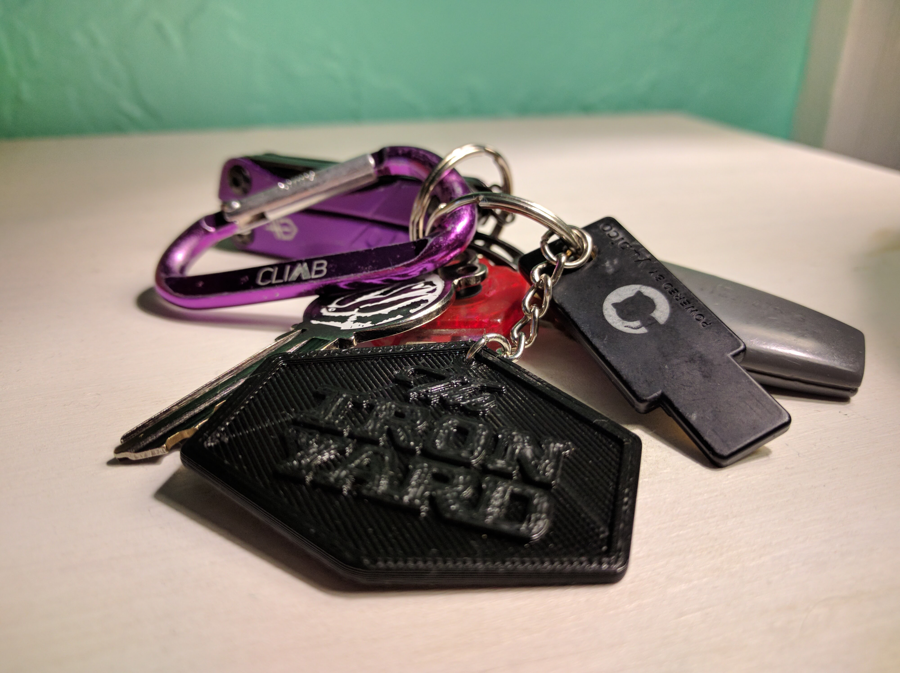

# TIY Keychain

[OpenSCAD](http://www.openscad.org) source to create a 3D printable TIY logo for use on a keychain.

50mm wide, barely smaller than the size of official TIY stickers (2"). Scale em up 1.5% or so if you want.

To convert EPS to DXF, for OpenScad import (on Mac):

    brew install pstoedit

    pstoedit -dt -f "dxf: -polyaslines -mm" shield.eps shield.dxf
    pstoedit -dt -f "dxf: -polyaslines -mm" text.eps text.dxf

## TODOs

- [ ] Widen the hole for the key ring a tiny bit
- [ ] Two-tone version?
